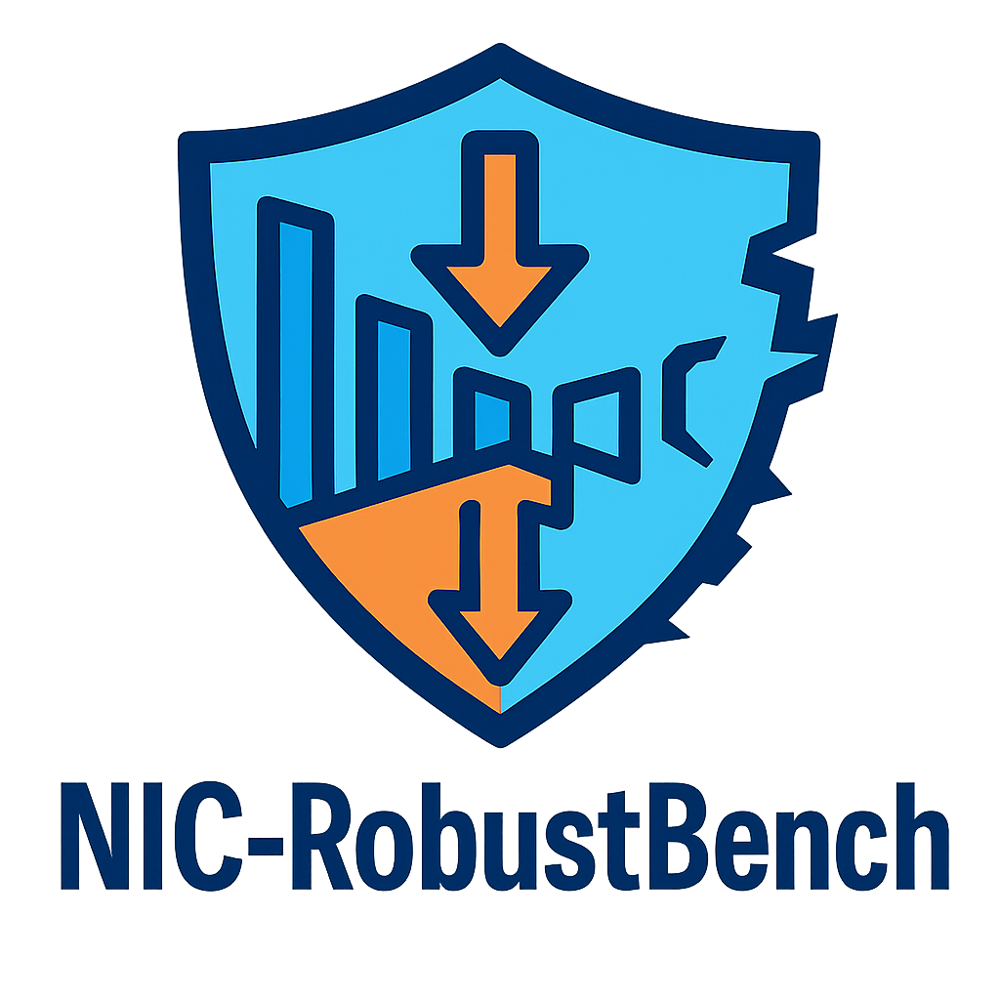
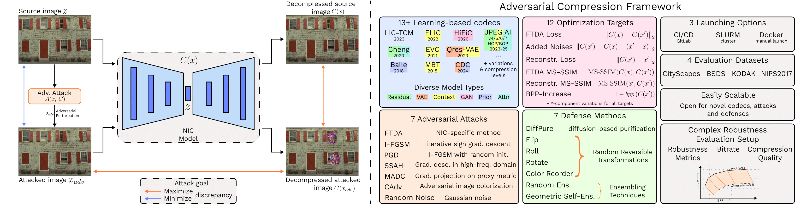

#  NIC-RobustBench

A Comprehensive Open-Source Toolkit for Neural Image Compression and Robustness Analysis. Please refer to the paper for more details:



## :sparkles: Features
- **13+ Neural Image Codecs** (e.g., JPEGAI v7.1, HiFiC, etc.)  
- **7 Adversarial Attack Algorithms** with **12 loss functions**  
- **Plug-and-Play API** — add your own codec or attack in <50 LOC  
- **One-command Experiments** via Docker + `launch.sh`  
- **Three launching options** — Docker, Slurm and GitLab CI/CD

## :whale: Prerequisites
- Docker 23+ with NVIDIA Container Toolkit
- 40 Gb of GPU RAM
- We provide Dockerfiles with complete list of requirements

## :zap: Quick Start
Visit [GitLab repository](https://vg-code.gml-team.ru/framework/codecs-robustness) to find out more about GitLab CI/CD launch.

```bash
# Download source code
git pull https://github.com/msu-video-group/NIC-RobustBench
cd NIC-RobustBench

# build docker images
# if you change image names, please change DOCKER_IMAGE and DOCKER_IMAGE_JPEGAI variables accordingly in launch.sh script
sudo docker build -f main.Dockerfile -t codecs_main . 
sudo docker build -f jpegai.Dockerfile -t codecs_jpegai .
# note that building can take up to 20-30 minutes
 
# run attack
chmod +x launch.sh
./launch.sh {attack_preset} {loss_name} {attack_name} {codec_name} {defence_name} {gpu_id}

# example of launching
./launch.sh 0 bpp_increase_loss random-noise jpegai-v51-hop-b05 0

# to launch a set of attacks/codecs you can edit launch_all.sh script
# configure launch_all.sh to run desired attacks/codecs 
chmod +x launch.sh launch_all.sh
./launch_all.sh
```

Be aware that the first time script is launching it will download all necessary weights of about 10 Gb. To download them manually run in the root of directory:
```bash
wget --backups=1 -nv https://titan.gml-team.ru:5003/fsdownload/o3kmmUJdU/models.zip \
         https://titan.gml-team.ru:5003/fsdownload/o3kmmUJdU/models.zip && rm models.zip.1
```

#### Datasets
We include one image from each of BSDS, NIPS2017, Kodak PhotoCD and CityScapes datasets in this repository. You can download these datasets completely via:
```bash
wget --backups=1 -nv https://titan.gml-team.ru:5003/fsdownload/Hy8LfJM6e/codec-datasets.zip https://titan.gml-team.ru:5003/fsdownload/Hy8LfJM6e/codec-datasets.zip && codec-datasets.zip.1 
```

You can add any new dataset in the *datasets/codec-datasets* folder. If you do so, change TEST_DATASET_NAMES and TEST_DATASET_PATHS variables in scripts-docker/env_vars.sh accordingly. **Make sure each dataset subfolder contains at least one image.**